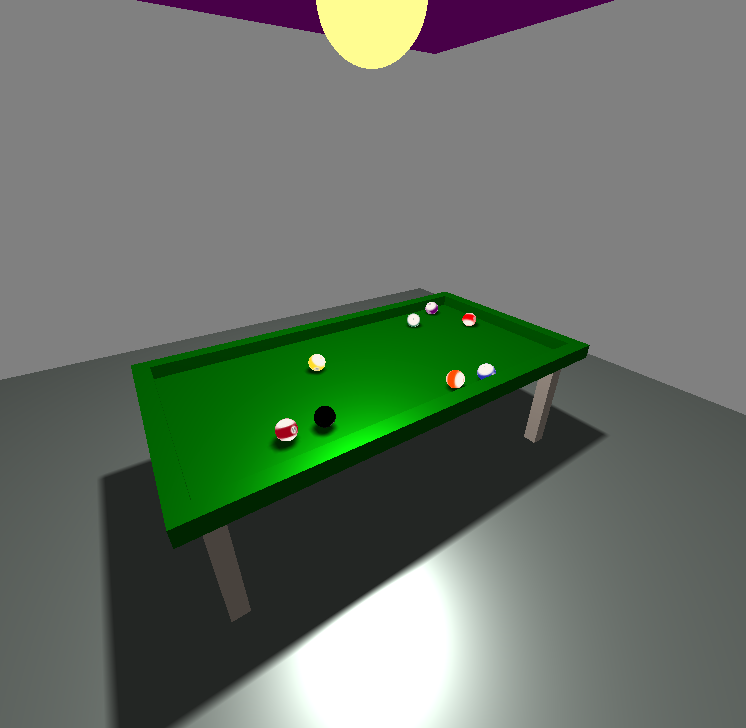

This is a billiard simulation written with THREE.js library. 

How to run: 

run on command line

http-server . -p 8000     (if you have npm installed)

or

python -m http.server     (if you have python installed)

then go to http://localhost:8000/ and choose billiard.html file.

